# Database Entity Relationship Diagram (ERD)

**Version:** 2025-12-20  
**Git Commit:** 4a8df92  
**Migration Files:** 21 migrations (001-021)  
**Generated:** 2025-12-20

## Database Schema Overview

This ERD represents the current state of the TAV 360 CRM database schema as of commit `4a8df92`.

## Entity Relationship Diagram

```mermaid
erDiagram
    %% Core Entities
    users ||--o{ marketing_logs : "sent_by"
    users {
        int id PK
        string email UK
        string password_hash
        string full_name
        enum app_role
    }
    
    contacts ||--o{ properties : "contact_id"
    contacts ||--o{ clients : "contact_id"
    contacts ||--o{ meetings : "contact_id"
    contacts ||--o{ tasks : "contact_id"
    contacts ||--o{ service_calls : "contact_id"
    contacts ||--o{ property_owners : "contact_id"
    contacts ||--o{ tenants : "contact_id"
    contacts ||--o{ project_leads : "contact_id"
    contacts ||--o{ marketing_leads : "contact_id"
    contacts ||--o{ work_orders : "contact_id"
    contacts ||--o{ accounting_documents : "contact_id"
    contacts {
        int id PK
        string full_name
        string phone
        string email
        text address
        text notes
        timestamp created_date
        timestamp updated_date
    }
    
    %% Property Management
    properties ||--o{ service_calls : "property_id"
    properties ||--o{ property_owners : "property_id"
    properties ||--o{ tenants : "property_id"
    properties ||--o{ matches : "property_id"
    properties ||--o{ work_orders : "property_id"
    properties ||--o{ accounting_documents : "property_id"
    properties {
        int id PK
        int contact_id FK
        string category
        string property_type
        string city
        string area
        string street
        numeric price
        int rooms
        timestamp created_date
        timestamp updated_date
    }
    
    clients ||--o{ matches : "client_id"
    clients {
        int id PK
        int contact_id FK
        string request_type
        string preferred_property_type
        numeric budget
        string preferred_rooms
        string city
        timestamp created_date
        timestamp updated_date
    }
    
    matches {
        int id PK
        int property_id FK
        int client_id FK
        int match_score
        string status
        text notes
        timestamp created_date
        timestamp updated_date
    }
    
    %% Meetings & Tasks
    meetings {
        int id PK
        string title
        timestamp start_date
        timestamp end_date
        string location
        text description
        int contact_id FK
        timestamp created_date
        timestamp updated_date
    }
    
    tasks {
        int id PK
        string title
        text description
        enum status
        enum priority
        timestamp due_date
        int contact_id FK
        timestamp created_date
        timestamp updated_date
    }
    
    %% Service Management
    service_calls {
        int id PK
        string title
        text description
        enum status
        int property_id FK
        int contact_id FK
        int supplier_id FK
        timestamp created_date
        timestamp updated_date
    }
    
    suppliers ||--o{ service_calls : "supplier_id"
    suppliers ||--o{ work_orders : "supplier_id"
    suppliers {
        int id PK
        string name
        string contact_person
        string phone
        string email
        text address
        text notes
        timestamp created_date
        timestamp updated_date
    }
    
    property_owners {
        int id PK
        int contact_id FK
        int property_id FK
        numeric ownership_percentage
        text notes
        timestamp created_date
        timestamp updated_date
    }
    
    tenants {
        int id PK
        int contact_id FK
        int property_id FK
        date lease_start_date
        date lease_end_date
        numeric monthly_rent
        numeric deposit
        text notes
        timestamp created_date
        timestamp updated_date
    }
    
    work_orders {
        int id PK
        string title
        text description
        string status
        int property_id FK
        int contact_id FK
        int supplier_id FK
        numeric cost
        timestamp created_date
        timestamp updated_date
    }
    
    %% Projects
    projects ||--o{ project_leads : "project_id"
    projects {
        int id PK
        string name
        text description
        string location
        string developer
        int total_units
        numeric price_range_min
        numeric price_range_max
        string status
        timestamp created_date
        timestamp updated_date
    }
    
    project_leads {
        int id PK
        int contact_id FK
        int project_id FK
        string interest_level
        numeric budget
        string preferred_units
        text notes
        timestamp created_date
        timestamp updated_date
    }
    
    %% Marketing
    marketing_leads ||--o{ marketing_logs : "lead_id"
    marketing_leads {
        int id PK
        int contact_id FK
        string phone_number
        string first_name
        string last_name
        numeric budget
        string neighborhood
        string street
        int rooms_min
        int rooms_max
        string client_type
        string seriousness
        text additional_notes
        boolean opt_out_whatsapp
        string source
        timestamp created_date
        timestamp updated_date
    }
    
    marketing_logs {
        int id PK
        int lead_id FK
        string phone_number
        text message_sent
        string status
        int sent_by FK
        timestamp created_date
    }
    
    campaigns ||--o{ campaign_metrics : "campaign_id"
    campaigns {
        int id PK
        string name
        text description
        date start_date
        date end_date
        string status
        timestamp created_date
        timestamp updated_date
    }
    
    campaign_metrics {
        int id PK
        int campaign_id FK
        int sent_count
        int delivered_count
        int opened_count
        int clicked_count
        int conversion_count
        numeric cost
        timestamp created_date
        timestamp updated_date
    }
    
    %% Accounting
    accounting_documents {
        int id PK
        string document_type
        string document_number
        numeric amount
        date date
        int property_id FK
        int contact_id FK
        string file_url
        text notes
        timestamp created_date
        timestamp updated_date
    }
    
    %% Compliance
    do_not_call_list {
        int id PK
        string phone_number UK
        text reason
        text notes
        timestamp created_date
        timestamp updated_date
    }
```

## Entity Summary

### Core Entities (2)
- **users** - System users with role-based access
- **contacts** - Central contact management (people/companies)

### Property Management (3)
- **properties** - Real estate properties
- **property_owners** - Property ownership relationships
- **tenants** - Tenant/lease management

### Brokerage (3)
- **clients** - Buyer/renter clients
- **matches** - Property-client matching
- **meetings** - Scheduled meetings/appointments

### Projects (2)
- **projects** - Real estate development projects
- **project_leads** - Project interest/leads

### Service Management (3)
- **service_calls** - Service requests/issues
- **suppliers** - Service providers/vendors
- **work_orders** - Work order management

### Marketing (4)
- **marketing_leads** - Marketing campaign leads
- **marketing_logs** - Marketing message history
- **campaigns** - Marketing campaigns
- **campaign_metrics** - Campaign performance metrics

### Operations (2)
- **tasks** - Task management
- **accounting_documents** - Financial documents

### Compliance (1)
- **do_not_call_list** - Opt-out phone numbers

## Key Relationships

1. **Contact-Centric Design**: The `contacts` table is the central hub, referenced by most entities (properties, clients, meetings, tasks, etc.)

2. **Property Relationships**:
   - Properties → Contacts (owner/agent)
   - Properties → Property Owners (ownership)
   - Properties → Tenants (rental)
   - Properties → Service Calls (maintenance)
   - Properties → Matches (brokerage)

3. **Brokerage Flow**:
   - Clients (buyers) ↔ Matches ↔ Properties
   - Meetings connect clients to properties

4. **Project Flow**:
   - Projects → Project Leads → Contacts

5. **Service Flow**:
   - Service Calls → Properties → Suppliers
   - Work Orders → Properties/Contacts → Suppliers

6. **Marketing Flow**:
   - Campaigns → Campaign Metrics
   - Marketing Leads → Marketing Logs → Users

## Foreign Key Relationships

| Parent Table | Child Table | Foreign Key | Relationship |
|-------------|-------------|-------------|--------------|
| contacts | properties | contact_id | One-to-Many |
| contacts | clients | contact_id | One-to-Many |
| contacts | meetings | contact_id | One-to-Many |
| contacts | tasks | contact_id | One-to-Many |
| contacts | service_calls | contact_id | One-to-Many |
| contacts | property_owners | contact_id | One-to-Many |
| contacts | tenants | contact_id | One-to-Many |
| contacts | project_leads | contact_id | One-to-Many |
| contacts | marketing_leads | contact_id | One-to-Many |
| contacts | work_orders | contact_id | One-to-Many |
| contacts | accounting_documents | contact_id | One-to-Many |
| properties | service_calls | property_id | One-to-Many |
| properties | property_owners | property_id | One-to-Many |
| properties | tenants | property_id | One-to-Many |
| properties | matches | property_id | One-to-Many |
| properties | work_orders | property_id | One-to-Many |
| properties | accounting_documents | property_id | One-to-Many |
| clients | matches | client_id | One-to-Many |
| projects | project_leads | project_id | One-to-Many |
| marketing_leads | marketing_logs | lead_id | One-to-Many |
| campaigns | campaign_metrics | campaign_id | One-to-Many |
| suppliers | service_calls | supplier_id | One-to-Many |
| suppliers | work_orders | supplier_id | One-to-Many |
| users | marketing_logs | sent_by | One-to-Many |

## Notes

- All tables include `created_date` and `updated_date` timestamps for audit trails
- Most foreign keys are nullable to allow flexible data entry
- The `matches` table implements a many-to-many relationship between properties and clients
- `property_owners` allows multiple owners per property with ownership percentages
- `do_not_call_list` has a unique constraint on `phone_number` to prevent duplicates

## Migration History

This ERD reflects the database state after applying migrations:
- 001_create_users.sql
- 002_create_contacts.sql
- 003_create_properties.sql
- 004_create_clients.sql
- 005_create_meetings.sql
- 006_create_tasks.sql
- 007_create_service_calls.sql
- 008_create_suppliers.sql
- 009_create_projects.sql
- 010_create_additional_tables.sql
- 011_create_marketing_logs.sql
- 013_create_property_owners.sql
- 014_create_tenants.sql
- 015_create_matches.sql
- 016_create_project_leads.sql
- 017_create_work_orders.sql
- 018_create_do_not_call_list.sql
- 019_create_campaigns.sql
- 020_create_campaign_metrics.sql
- 021_create_accounting_documents.sql

